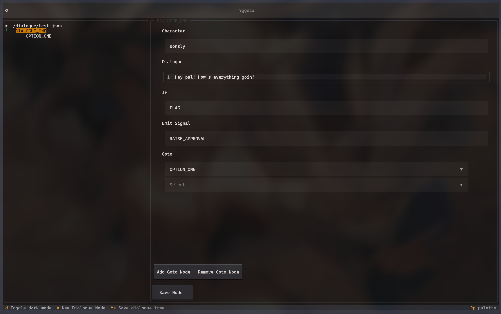

# yggdia
Terminal-based game dialogue tree editor made with python



## Usage
You'll need python and the [textual](https://textual.textualize.io/) library installed:

```pip install textual```

After that, you can run the program by specifying the JSON file you want to edit:

```python /path/to/project/src filename```

If confused, run the help command with ```python /path/to/project/src -h```

### JSON format
The dialogue nodes are structured in JSON as follows (NOTE: slightly WIP)

```json
{
    "DIALOGUE_NODE_ID": {
        "character": "This is the name of the current speaking character.",
        "text": "This is the dialogue being spoken.",
        "if_cond": "FLAG_WILL_EMIT_SIGNAL_IF_TRUE",
        "signal": "SIGNAL_TO_EMIT_TO_CHECK_IN_GAME",
        "diceroll": 0,
        "goto": [
            "OTHER_DIALOGUE_NODE_YOU_PROGRESS_FROM_HERE",
            "YOU_CAN_HAVE_AS_MANY_AS_YOU_WANT",
            "MULTIPLE_GOTO_NODES_INDICATE_DIALOGUE_OPTIONS"
        ]
    }
}
```

